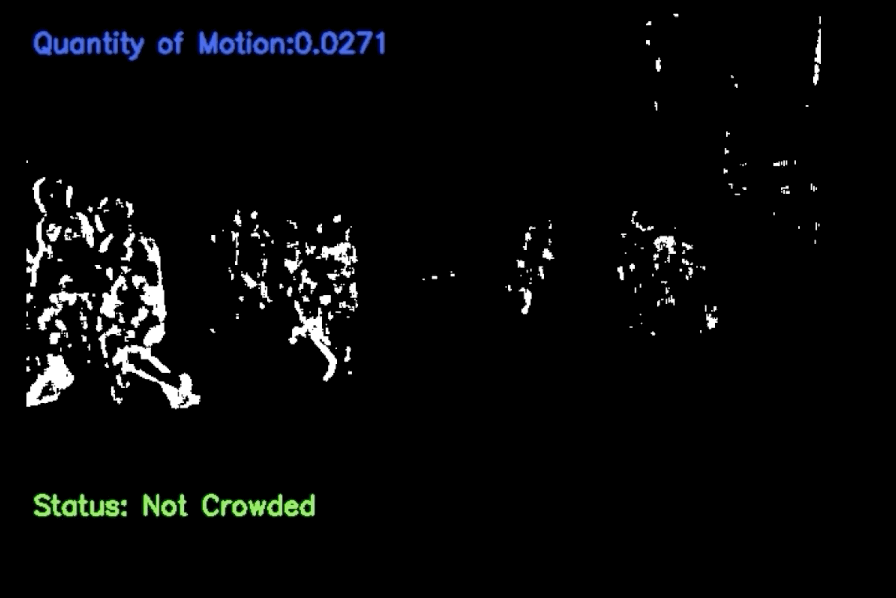

# OpenCV-Background-Subtraction
OpenCV Application to execute BackgroundSubtractorMOG2 algorithm.

Detection of crowd for outdoor settings using Quantity of Motion Value.

White pixels are counted, and on the count, it's decided whether the street is crowded or not.

Application demo:

OpenCV for Android SDK version: 3.4.10

Tested on Android 10 - API 29

More screenshots present in the app-demo folder.

For more information and queries, please feel free to email me.
